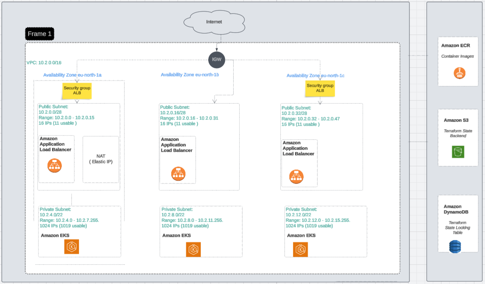

# aws-platform-terraform

Table of contents 
+ About the Project [--->](#about-the-project)
+ Project Structure [--->](#project-structure)
+ Architecture Diagram [--->](#architecture-diagram)
+ Quick Start [--->](#quick-start)
+ Usage [--->](#usage)
+ Remote State Management [--->](#remote-state-management)
+ Cost Management [--->](#cost-management)
+ Troubleshooting [--->](#troubleshooting)

## About the Project
Terraform infrastructure automation for AWS: VPC, ECR, S3.    
Dev and prod environments with remote state management and troubleshooting documentation.

#### AWS Resources Created by This Code

**VPC** 
- 1 VPC with configurable CIDR block
- 2 public subnets (across 2 Availability Zones)
- 2 private subnets (across 2 Availability Zones)
- 1 Internet Gateway (IGW) for public subnet routing
- 2 NAT Gateways with 2 Elastic IPs for private subnet egress
- Route tables (public and private) with appropriate associations
- 2 Security Groups (ALB, EKS)

**ECR**   

**S3**    
S3 backend with DynamoDB locking table for team collaboration 
- 1 S3 buckets  /
- 2 S3 buckets (artifacts, backups)


> <span style="color: red"> ! IMPORTANT</span>
> Provisioning this infrastructure will create AWS resources that generate costs. Always destroy unused resources and monitor usage through AWS Billing, Budgets, and Cost Explorer to prevent unexpected charges.

### Architecture Diagram  


### Quick Start

**Prerequisites**
```
terraform >= 1.0
aws-cli >= 2.0
```

**Deploy**

1. Clone the repo:
```
git clone https://github.com/your-username/aws-platform-terraform.git
cd aws-platform-terraform
```

2. Initialize Terraform (creates S3 and DynamoDB if needed):
```
cd terraform/environments/dev
terraform init
```

3. Plan and review changes:

```
terraform plan -out=tfplan
```

4. Apply:
```
terraform apply tfplan
```

5. Destroy (for dev/testing)
```
terraform destroy
```

### Usage


### Remote State Management

Terraform uses an S3 bucket to store state and a DynamoDB table for state locking; both must be created before initializing the backend.

### Cost Management

Provisioning this infrastructure will create AWS resources that generate costs. Always destroy unused resources to avoid unnecessary charges..

To monitor AWS resources, use AWS Cost Explorer to be aware of the price for every resource. 
You can also configure AWS Budgets, to set spending limits and receive notifications when thresholds are exceeded to prevent unexpected charges.


### Troubleshooting

